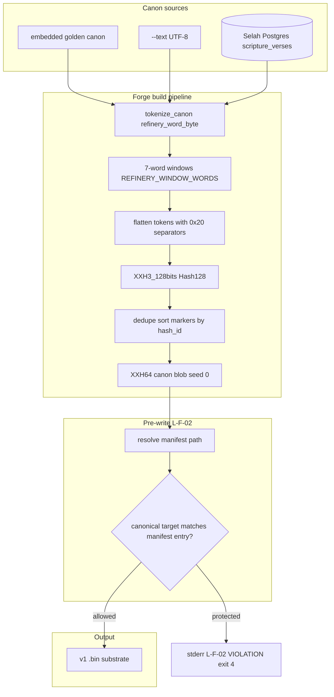
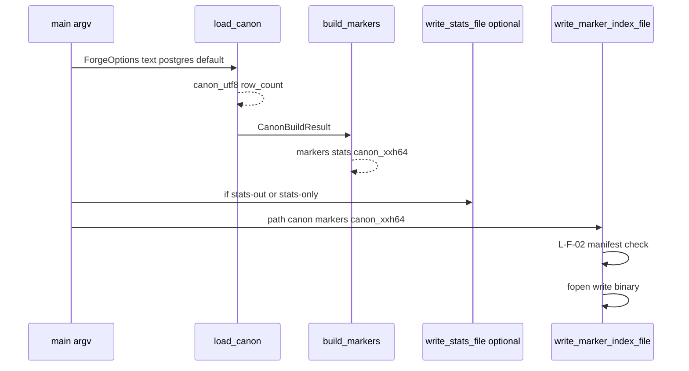
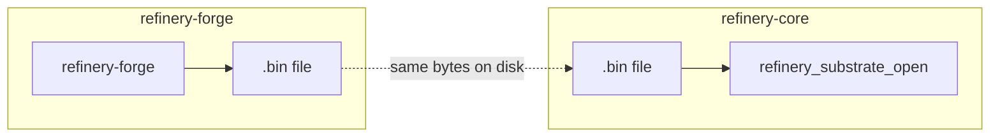

# Refinery-forge — current state (architecture and flow)

This document describes **what refinery-forge does today**: building **v1 marker-index** `.bin` substrates from embedded demo text, `--text`, or (optional **`libpq`**) Selah Postgres; enforcing **L-F-02** protected paths; and owning the **L-R-01 evidence ledger** plus **L-F-03 entropy tank** producer surfaces. It is a companion to [`SUBSTRATE-LAYOUT.md`](SUBSTRATE-LAYOUT.md), [`FORGE-POSTGRES.md`](FORGE-POSTGRES.md), [`README.md`](../README.md), and the byte-identical shared headers in `include/refinery/` (must match **refinery-core**).

**Law / gate context:** Mechanical enforcement for hash parity, pinned third_party, shared header identity, evidence ledger replay, entropy tank transitions, and related probes lives in **refinery-core** [`scripts/refinery-gate.sh`](../../refinery-core/scripts/refinery-gate.sh). Forge implements producer-side rules such as **L-F-02** (protected substrate paths), **L-R-01** (ledger), and **L-F-03** (tank) in code here.

**E-51.G16 / L-K-03 (refinery-core only):** Event **G16** ratified law **L-K-03** (“kernel does not adapt at runtime”) by adding **gate-only** scanning of **`refinery-core/src/kernel/*.c`** for disallowed mutable **`static`** storage, with allow-list comments where needed. **Forge is not in the L-K-03 enforcement set** — the assignment scopes **Unit B (refinery-forge) as no-op**: **zero** G16-required edits here; forge is an **ingress producer**, not the mmap/router **kernel**. Operator-visible forge behavior is unchanged by G16; full-mode gate runs may still execute a **libpq-linked** forge binary built under **refinery-core** (e.g. **`build-auto/`**) without altering this repo. See **refinery-core** [`docs/E-51-G16-LK03-NO-RUNTIME-ADAPTATION-ASSIGNMENT.md`](../../refinery-core/docs/E-51-G16-LK03-NO-RUNTIME-ADAPTATION-ASSIGNMENT.md).

---

## 1. What refinery-forge is (and is not)

| In scope | Out of scope |
|----------|----------------|
| **Write** lawful v1 `.bin` files (header + sorted `Marker[]` + canon blob) | mmap validation, ingress spectroscopy, Terminus (**refinery-core**) |
| **Promote** tank state into an identity-only substrate artifact | assuming promoted markers are ingress-spectroscopy-reachable witness windows |
| **Golden path**: embedded default canon or `--text` | Training models, scoring LLMs |
| **Optional Postgres**: read **`scripture_verses`** via **`SELAH_DATABASE_URL`** only | Generic **`DATABASE_URL`** / **Aiden** tenant URLs |
| **L-F-02**: refuse overwrite when output canonical path matches operator manifest | Changing kernel runtime behavior |
| **L-R-01 / L-F-03**: evidence ledger + entropy tank state operations | Core runtime reads of ledger/tank artifacts |

Implementation units: **`src/forge/bitmask_generator.cpp`**, **`src/forge/ledger.cpp`**, and **`src/forge/tank.cpp`** → **`refinery-forge`** binary. **xxHash** (**XXH64** canon seal, **XXH3_128** window identity) via **`third_party/xxhash/`**.

---

## 2. Visual architecture (layers)

---

## 3. Shared contract (parity with refinery-core)

All token rules, window size, word-length cap, header layout, magic **`SELAHRF1`**, and flatten/hash steps are defined **only** in **`substrate_interface.h`** (must remain **byte-identical** with refinery-core). Forge **must not** redefine **`REFINERY_WINDOW_WORDS`**, **`refinery_word_byte`**, or window hashing locally beyond calling the shared spec.

**Outputs consumed by core:**

- **`magic`**: **8-byte** ASCII **`REFINERY_MAGIC_STR`** copied into **`SubstrateHeader`**, not a legacy integer-typed magic.
- **`canon_xxh64`**: classic **`XXH64(canon, len, 0)`**.
- **`Marker.hash_id`**: **XXH3_128** over the **seven-token** flattened buffer (six **`0x20`** separators).
- **Sort**: markers sorted ascending by **`(high64, low64)`**.

See [`SUBSTRATE-LAYOUT.md`](SUBSTRATE-LAYOUT.md) for validation rules that **refinery-core** applies on open.

---

## 4. Runtime flow: canon → markers → optional stats → write

**Exit codes (write path highlights):**

| Code | Meaning |
|------|---------|
| **0** | Success (or **`--stats-only`** after stats) |
| **1** | I/O or exception (**`std::exception`** message on stderr) |
| **2** | Usage / validation (**empty markers**, insufficient tokens, bad args) |
| **3** | **`REFINERY_MAX_MARKERS`** exceeded — SILENCE |
| **4** | **L-F-02** protected path — refuse overwrite |

---

## 5. Canon sources

### 5.1 Embedded golden (default)

If neither **`--text`** nor **`--from-postgres`**, forge uses a fixed **`kGoldenCanon`** string in **`bitmask_generator.cpp`**. The tracked artifact **`golden.marker.bin`** must match a forge build writing that canon; **`scripts/verify-golden.sh`** rebuilds and **`cmp`s** against **`golden.marker.bin`**.

### 5.2 `--text`

Operator-supplied UTF-8 string; must yield at least **`REFINERY_WINDOW_WORDS`** (**7**) tokens per **`refinery_word_byte()`**.

### 5.3 Postgres (**`REFINERY_HAVE_LIBPQ`**)

- **Env:** **`SELAH_DATABASE_URL`** only (see [`FORGE-POSTGRES.md`](FORGE-POSTGRES.md)).
- **Default SQL:** **`scripture_verses.text_quote`**, **`ORDER BY canonical_position`**.
- Rows concatenated with **`\\n`** between non-empty quotes.

---

## 6. L-F-02 protected-path guard (pre-write)

**Purpose:** Avoid overwriting operator-declared **live** substrate paths when staging builds.

**Manifest resolution order** (`refinery_resolve_manifest_path`):

1. **`REFINERY_SUBSTRATE_MANIFEST`** if set — must be **readable**; if set but unreadable → **throws** (fatal).
2. **`./.active-substrate-paths`** (cwd-relative).
3. **`./refinery-core/.active-substrate-paths`** (nested checkout under forge tree).
4. **Executable-relative sibling:** canonical **`argv[0]`** directory’s parent + **`refinery-core/.active-substrate-paths`** (supports **`build/refinery-forge`** next to **`refinery-core`**).
5. Else **empty** → no manifest.

**Check** (`write_marker_index_file` **before** opening output):

- If manifest non-empty and **`refinery_path_is_protected(out_path, manifest)`** → stderr **`L-F-02 VIOLATION: ...`** → return **4**.
- If manifest **empty** → single stderr line **`L-F-02: no active-substrate manifest found; protected-path check skipped`** → continue write.

**Manifest line semantics:** blank lines, **`#`** comments, trailing whitespace trimmed; each entry **canonicalized** with **`realpath`** where possible; compared to the canonical target path (**`realpath`** on existing path, else canonical parent + basename). **Stale / missing manifest entries** are skipped (no hard failure for unrelated writes).

---

## 7. How refinery-core fits (parity, not runtime)

Forge **produces** bytes; core **validates and reads** them. Parity is enforced by the shared header and by **refinery-core**’s gate (**PARITY** probes vs forge + **`tools/gen_golden_substrate.c`**). Forge does **not** link refinery-core.

---

## 8. Primary source files (quick map)

| Area | Files |
|------|--------|
| Forge CLI + pipeline + L-F-02 | [`src/forge/bitmask_generator.cpp`](../src/forge/bitmask_generator.cpp) |
| Evidence ledger | [`src/forge/ledger.cpp`](../src/forge/ledger.cpp) |
| Entropy tank | [`src/forge/tank.cpp`](../src/forge/tank.cpp) |
| Shared v1 contracts | `include/refinery/substrate_interface.h`, `ledger_interface.h`, `tank_interface.h` |
| xxHash | [`third_party/xxhash/`](../third_party/xxhash/) |
| Build (optional libpq) | [`CMakeLists.txt`](../CMakeLists.txt) |
| Golden parity script | [`scripts/verify-golden.sh`](../scripts/verify-golden.sh) |
| Layout reference | [`docs/SUBSTRATE-LAYOUT.md`](SUBSTRATE-LAYOUT.md) |
| Postgres / Selah | [`docs/FORGE-POSTGRES.md`](FORGE-POSTGRES.md) |
| Operator README | [`README.md`](../README.md) |
| Checked-in golden artifact | [`golden.marker.bin`](../golden.marker.bin) |

---

## 9. Operator quick paths

| Goal | Steps |
|------|--------|
| Build (no DB) | [`README.md`](../README.md) clang recipe or CMake without Postgres |
| Build + Postgres | Define **`REFINERY_HAVE_LIBPQ`**, link **`libpq`**, set **`SELAH_DATABASE_URL`** |
| Evidence/tank operation | Set **`REFINERY_EVIDENCE_LEDGER`** and **`REFINERY_ENTROPY_TANK`**, or install **`refinery-core/.evidence-ledger-path`** and **`refinery-core/.entropy-tank-path`**, then use `--witness`, `--refute`, `--reject`, `--evict`, or `--promote-tank-to-substrate` |
| Verify golden unchanged | **`./scripts/verify-golden.sh`** from repo root |
| Full gate + DB snapshot | Run **refinery-core** **`./scripts/refinery-gate.sh --full`** with **`REFINERY_FORGE_BIN`** pointing at libpq forge (see core docs) |

---

## 10. Operator use cases (sequential steps)

Language below is **operator-oriented**: follow steps in order unless noted optional. For copy-paste build commands, see [`README.md`](../README.md).

### 10.1 Build `refinery-forge` without Postgres (`libpq`)

1. Open a shell at the **refinery-forge** repository root (directory containing **`include/`**, **`src/forge/`**, **`third_party/xxhash/`**).
2. Create a build directory: **`mkdir -p build`**.
3. Compile xxHash: **`clang -std=c11 -O2 -c third_party/xxhash/xxhash.c -I third_party/xxhash -o build/xxhash.o`**.
4. Compile and link forge: use the **`clang++`** line from [`README.md`](../README.md) **Golden path** that includes **`src/forge/bitmask_generator.cpp`**, **`src/forge/ledger.cpp`**, **`src/forge/tank.cpp`**, and **`build/xxhash.o`**, output **`build/refinery-forge`** (or another path you prefer).
5. Confirm the binary runs: **`./build/refinery-forge --help`** (usage printed, exit **0**).

### 10.2 Write a `.bin` using the **embedded default canon** (no `--text`, no DB)

1. Complete **§10.1** so **`./build/refinery-forge`** exists.
2. Choose an output path, e.g. **`./marker.bin`** or **`./golden.marker.bin`**.
3. Run **`./build/refinery-forge --out ./marker.bin`** from the repo root (or pass any relative/absolute **`--out`**).
4. **Expected stderr:** one line **`L-F-02: no active-substrate manifest found; protected-path check skipped`** unless you configured a manifest (**§10.7**). That warning is normal when protection is not deployed.
5. **Expected exit code:** **0**. The file at **`--out`** is a lawful v1 substrate for the embedded **`kGoldenCanon`** string in **`bitmask_generator.cpp`**.

### 10.3 Write a `.bin` from **`--text`** (custom canon)

1. Complete **§10.1**.
2. Prepare a UTF-8 string that yields at least **seven** tokens per **`refinery_word_byte()`** (ASCII letters/digits only inside tokens; see [`substrate_interface.h`](../include/refinery/substrate_interface.h)).
3. Run **`./build/refinery-forge --text 'your canon here' --out ./custom.marker.bin`** (quote safely for your shell).
4. If the text has too few tokens, forge prints an error and exits **2**.
5. On success, exit **0** and **`custom.marker.bin`** reflects that canon’s markers and **`canon_xxh64`**.

### 10.4 Confirm **`golden.marker.bin`** matches the repo fixture

1. Complete **§10.1** (or ensure **`build/refinery-forge`** exists and matches current sources).
2. From the repository root, run **`./scripts/verify-golden.sh`**.
3. **Expected:** **`verify-golden: OK (golden.marker.bin matches default canon output)`** and exit **0**.
4. If the script fails with a **cmp** mismatch, either regenerate **`golden.marker.bin`** intentionally (**`./build/refinery-forge --out golden.marker.bin`**) after a deliberate canon/header change, or fix drift in sources before committing.

### 10.5 Build **with `libpq`** and extract canon from **Selah**

1. Install development headers/libs for **libpq** (paths vary by OS; [`README.md`](../README.md) shows **Homebrew**-style **`-I`** / **`-L`** flags).
2. Rebuild forge with **`REFINERY_HAVE_LIBPQ=1`** and link **`-lpq`**, producing a binary that includes **`load_canon_from_postgres`** (see README **Postgres** section).
3. Store **`SELAH_DATABASE_URL`** in a **chmod-600** env file; **`source`** it in your shell (**`set -a; source …; set +a`**) — do not paste credentials into git or logs.
4. Run forge with **`--from-postgres`**, e.g. **`./build/refinery-forge --from-postgres --limit 512 --out ./golden-set.marker.bin --stats --stats-out ./golden-set.stats.json`** (adjust **`--limit`**, paths, and flags).
5. **`unset SELAH_DATABASE_URL`** (or exit the shell) when finished so the secret is not left in the environment.
6. If **`SELAH_DATABASE_URL`** is unset, forge throws and exits **1**. If marker count would exceed **`REFINERY_MAX_MARKERS`**, forge exits **3** (SILENCE) and does not write an oversized **`.bin`**.

### 10.6 Emit **stats** only or stats **plus** binary

1. **Stats printed to stdout:** add **`--stats`** to any successful run; forge prints row/canon/word/window counts and bucket summary.
2. **Stats JSON:** add **`--stats-out path.json`**; forge writes one JSON object (failure to write returns **1**).
3. **No binary write:** use **`--stats-only`** (still computes markers; does not call **`write_marker_index_file`**). Exit **0** if stats paths succeed.

### 10.7 **L-F-02** protected paths (manifest)

1. Decide where the manifest lives: **`REFINERY_SUBSTRATE_MANIFEST`**, or **`./.active-substrate-paths`**, or **`./refinery-core/.active-substrate-paths`**, or the sibling path resolved from **`argv[0]`** (**§6**).
2. Put **one canonical filesystem path per line** for substrates that must **not** be overwritten by forge. Lines may use **`#`** comments; blank lines ignored; trim applies.
3. Run forge with **`--out`** pointing at a path that **canonicalizes** to a listed entry → stderr **`L-F-02 VIOLATION: ...`** and exit **4** (no truncate of the protected file).
4. Run forge with **`--out`** to an **unlisted** path → write proceeds (subject to other errors). Entries that no longer exist on disk are **skipped** during matching, not a global failure.
5. If **`REFINERY_SUBSTRATE_MANIFEST`** is set to an **unreadable** path, forge throws (**exit 1**). If no manifest is found, you still get the single **skipped** warning (**§10.2**).

### 10.8 Build via **CMake** (optional)

1. **`cmake -S . -B build`** from repo root.
2. **`cmake --build build`** — if **PostgreSQL** is found, the target links **`libpq`** and defines **`REFINERY_HAVE_LIBPQ`**; otherwise you get a DB-less binary (same as **§10.1** behavior for Postgres flags).
3. Run **`./build/refinery-forge`** with the same CLI flags as above.

### 10.9 Full **refinery-gate** with this forge (sibling **refinery-core**)

1. Build a **libpq** forge binary if the gate will run **`--full`** (Probe F / **`L-12`**).
2. Export **`REFINERY_FORGE_BIN`** to the absolute path of that binary (see **refinery-core** [`LAWS.md`](../../refinery-core/LAWS.md) / gate docs).
3. From **refinery-core**, run **`./scripts/refinery-gate.sh`** or **`./scripts/refinery-gate.sh --full`** with **`SELAH_DATABASE_URL`** set when required.
4. Treat **FAIL** lines as blocking; **`GATE: PASS`** means forge participated successfully in parity / law probes for that configuration.

---

## 11. Summary sentence

**refinery-forge** turns **canon UTF-8** (embedded, **`--text`**, or **Selah**) into a **SELAHRF1-sealed** v1 **`.bin`** using the **same** tokenizer and **XXH3_128 / XXH64** rules as **refinery-core**, refuses writes that exceed **`REFINERY_MAX_MARKERS`**, and applies **L-F-02** manifest checks so operator-declared **live** substrate paths are not overwritten by accident.
